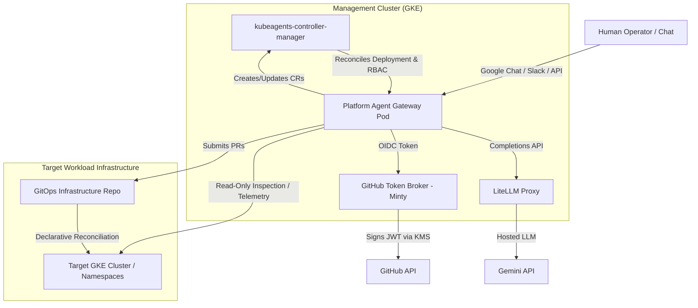

---
---
# Architectural and Security Summary: kube-agents

This document provides an overview of the updated system architecture of the Kubernetes Agentic Harness (`kube-agents`) and analyzes the security boundaries, privileges, and touchpoints across its components.

> [!NOTE]
> **Architecture Update**: The harness has transitioned from a multi-subagent architecture (`Platform`, `Operator`, `DevTeam`) to a **unified single-agent model** centered around the **Platform Agent** (`platform`). The `k8s-operator` now exclusively manages the `PlatformAgent` Custom Resource Definition (`platformagents.kubeagents.x-k8s.io`).

---

## 1. High-Level System Architecture

`kube-agents` is a single-agent system designed for GKE/Kubernetes operations. It replaces traditional CLI and console interfaces (`kubectl`, `gcloud`, Google Cloud Console) with an autonomous, intent-driven agent gateway.

---

## 2. Component Directory & Role Analysis

### 2.1. Kubernetes Operator (`k8s-operator`)
* **Role**: The Go-based control plane (Kubebuilder) for the harness. It defines and reconciles the `PlatformAgent` Custom Resource (`platformagents.kubeagents.x-k8s.io`). It provisions the agent gateway pod, persistent volume claim (PVC), config maps, service accounts, and RBAC bindings.
* **Security Touchpoint**:
  * Runs with the `controller` KSA in the `kubeagents-system` (or `system`) namespace.
  * Holds cluster-scoped RBAC permissions to manage Deployments, PVCs, ConfigMaps, Services, ServiceAccounts, ClusterRoles, and ClusterRoleBindings.
  * Configured with GCP Workload Identity to interact with GCP APIs if needed (`roles/container.admin` / `roles/container.clusterViewer`).

### 2.2. Platform Agent (`platform`)
* **Role**: The unified master custodian, architect, and SRE observer. It serves as the primary frontend (via Google Chat, Slack, or REST API), manages GKE fleet infrastructure, enforces multi-tenancy, monitors telemetry, and provides application/infrastructure troubleshooting.
* **Security Touchpoint**:
  * **K8s RBAC**: Bound to `view` ClusterRole (read-only access to standard K8s resources across namespaces) and `kubeagents:explorer` ClusterRole (read access to `nodes`, `pods`, `namespaces`, and `customresourcedefinitions`).
  * **GCP IAM (Default Stance)**: Bound via Workload Identity to a GCP Service Account (GSA) with project-level roles: `roles/container.admin`, `roles/container.clusterAdmin`, `roles/monitoring.admin`, `roles/logging.admin`, `roles/iam.serviceAccountUser`, and `roles/iam.securityReviewer`.
  * **GitOps Mutation Flow**: Infrastructure and application mutations are enforced out-of-band via Git Pull Requests. The agent uses the **GitHub Token Broker (Minty)** to obtain short-lived, repository-scoped installation tokens (`submit-suggestion` skill).

### 2.3. GitHub Token Broker (Minty)
* **Role**: Authenticates the Platform Agent using GKE OIDC tokens and brokers short-lived (1-hour), repository-scoped GitHub installation tokens.
* **Security Design**:
  * The master GitHub App private key is stored securely in GCP KMS (`AsymmetricSign`). Minty never exposes private keys in plaintext.
  * Access is enforced via CEL authorization rules defined in a ConfigMap, limiting token generation to authenticated agent ServiceAccounts.

---

## 3. Privilege & Identity Matrix: Stance Comparison

The table below contrasts the **Current Default Stance** with the **Hypothetical Read-Only Advisor Scenario**:

| Component / Dimension | Current Default Stance | Hypothetical Read-Only Advisor Scenario | Security & Operational Impact |
| :--- | :--- | :--- | :--- |
| **K8s RBAC (Host Cluster)** | `view` ClusterRole + `kubeagents:explorer` ClusterRole + `PlatformAgent` CR write access in namespace | `view` ClusterRole + `kubeagents:explorer` ClusterRole (Zero CR/pod/workload write access) | **Read-Only**: Prevents agent from creating or modifying any live Kubernetes resources. |
| **GCP IAM (GKE Control)** | `roles/container.admin`, `roles/container.clusterAdmin` | `roles/container.viewer` | **Critical Isolation**: Strips API-level GKE cluster mutation privileges. Attacker cannot delete clusters or modify node pools via GCP API. |
| **GCP IAM (Monitoring & Logs)**| `roles/monitoring.admin`, `roles/logging.admin` | `roles/monitoring.viewer`, `roles/logging.viewer`, `roles/cloudtrace.user` | **Read-Only Telemetry**: Agent can read metrics, logs, and traces for RCA, but cannot modify logging sinks or monitoring policies. |
| **GCP IAM (Identity & Security)**| `roles/iam.serviceAccountUser`, `roles/iam.securityReviewer` | `roles/iam.securityReviewer` | **No Identity Impersonation**: Agent cannot attach or assume arbitrary GCP Service Accounts. |
| **Mutation Channel** | Direct GCP/K8s API capability + GitOps PRs | **Strictly Out-of-Band via GitOps PRs** | **Enforced Human-in-the-Loop**: All recommendations must be reviewed and merged by human SREs before GitOps reconciliation. |
| **Prompt Injection Defense** | Moderate (relies on prompt guidelines + pod security context) | **Maximum** (Exploitation of LLM output cannot cause unauthorized cluster or GCP state changes) | Zero write footprint on cloud or cluster APIs. |

---

## 4. Key Security Boundaries and Touchpoints

1. **Prompt Injection to Cloud Escalation Boundary**: The Platform Agent is user-facing (Google Chat/Slack). In the default stance, a prompt injection vulnerability could allow an attacker to invoke `gcloud` or `kubectl` tools with `container.admin` privileges. In the Read-Only Advisor stance, this boundary is hardened because the GSA holds zero write roles.
2. **Declarative Mutation Boundary (Minty Token Broker)**: The Platform Agent does not store static GitHub secrets. It requests short-lived tokens from Minty using its projected GSA OIDC token (`/var/run/secrets/kubernetes.io/serviceaccount/token`).
3. **Operator Controller Privileges**: The Go operator controller runs with high permissions in `kubeagents-system` to reconcile the `PlatformAgent` custom resource. Validating webhooks enforce cardinality (1 agent per cluster, 1 agent per GCP project via GCS lock).

---

## 5. Security Evaluation & Recommendations

* **Current Risk**: The default GSA permissions (`roles/container.admin`, `roles/container.clusterAdmin`) exceed the agent's declared core rule ("Automation First via Declarative Workflow").
* **Recommended Posture**: Adopt the **Read-Only Advisor Scenario** for runtime agent executions. Grant the agent GSA read-only visibility (`container.viewer`, `logging.viewer`, `monitoring.viewer`, `iam.securityReviewer`) and force all infrastructure/workload changes to flow through GitHub Pull Requests via Minty.
