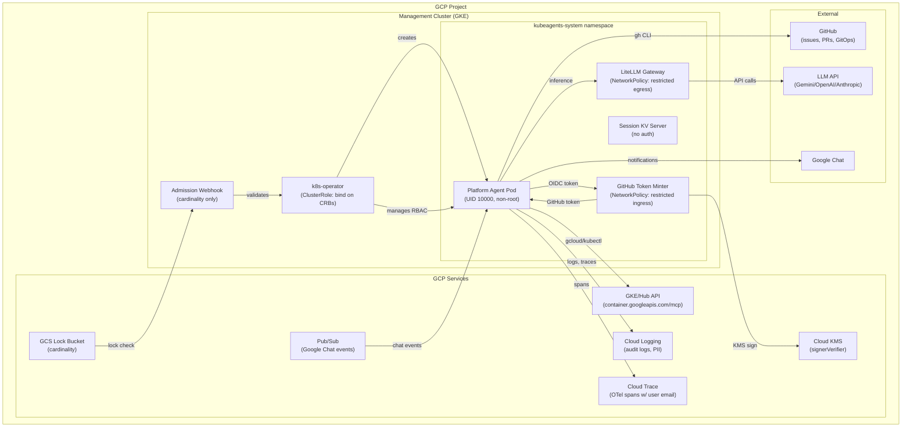

# Architectural & Security Summary

## System Architecture & Agent Model

The kube-agents system follows a **single-agent model**: only the Platform agent exists under `agents/`. The operator and devteam agents were removed per kube-agents issue #256. All operational scope — GKE cluster lifecycle management, multi-tenancy, security auditing, observability, cost analysis, and GitHub issue resolution — is consolidated into one agent.

The Platform agent runs as a Kubernetes Deployment managed by the `k8s-operator`, which reconciles a `PlatformAgent` custom resource (CRD group `kubeagents.x-k8s.io/v1alpha1`, Namespaced). The operator creates the agent's ServiceAccount, RBAC (ClusterRole + ClusterRoleBinding), PVCs, ConfigMaps, Deployment, and Service — and cleans them up on deletion.

**Agent identity & configuration** (findings [ARCH-001], [ARCH-002]):
- 2 MCP servers: `platform_control` (Python, GKE API/chat/API server) and `gke` (Node.js proxy to `container.googleapis.com/mcp`)
- 2 toolset profiles: `cli` (terminal sessions) and `api_server` (API-driven sessions) — both grant identical tools
- 4 plugins: `hermes_otel` (telemetry), `session_store`, `session_otel_bridge`, `tool_call_audit` (audit logging)
- Memory disabled by default (`memory_enabled: false`)
- Inference via LiteLLM gateway (Gemini, OpenAI, or Anthropic), deployed as a sidecar or separate service
- GitHub token brokering via Minty + KMS + OIDC for GitOps PR creation

## Component & Role Directory

| Component | Path | Role |
|---|---|---|
| **Platform Agent** | `agents/platform/` | Single operational agent: GKE fleet management, security, cost, observability, GitHub issues |
| **K8s Operator** | `k8s-operator/` | Reconciles PlatformAgent CRDs → creates/runs/cleans agent Deployment + RBAC |
| **LiteLLM Gateway** | `k8s-operator/config/integrations/litellm/` | Proxies LLM API calls (Gemini/OpenAI/Anthropic), handles API keys |
| **GitHub Token Minter (Minty)** | `k8s-operator/config/integrations/github/` | OIDC-authenticated, KMS-signed GitHub App installation tokens for GitOps |
| **Admission Webhook** | `k8s-operator/internal/webhook/platformagent_webhook.go` | Validates PlatformAgent cardinality (cluster-level + GCS global lock) |
| **Provisioning Scripts** | `k8s-operator/scripts/` | GCP IAM, GKE cluster, K8s secrets, gVisor node pool, GitHub minter deployment |
| **CI/CD** | `.github/workflows/` | 14 workflows: Docker publish, staging redeploy, operator tests, actionlint, auto-review |

## Key Security Boundaries

1. **Kubernetes RBAC boundary** — The operator has `bind` verb on ClusterRoles ([ARCH-005], Critical), enabling cluster-admin escalation if compromised. The agent gets cluster-scoped `view` + custom Explorer ClusterRole.

2. **CRD → Pod trust boundary** ([ARCH-003], High) — The PlatformAgent CRD spec allows arbitrary initContainers, sidecars, extra volumes, and env vars. The admission webhook validates only cardinality (one agent per project), not security posture. Users with CRD write access can escalate to arbitrary code execution in the agent pod.

3. **GCP IAM boundary** — The agent's GSA defaults to `gke-admin` (container.clusterAdmin + container.admin + monitoring.admin + iam.serviceAccountUser) at the project level. A read-only option exists but is not the default.

4. **Network boundary** — The agent pod has **no NetworkPolicy** (Critical). Sub-components (LiteLLM, Minty) have well-defined egress restrictions, but the most privileged workload has unrestricted network access.

5. **Inter-agent trust boundary** — `call_agent` propagates user identity via unauthenticated HTTP headers. API_SERVER_KEY falls back to literal `"none"` if unset.

## System Diagram

